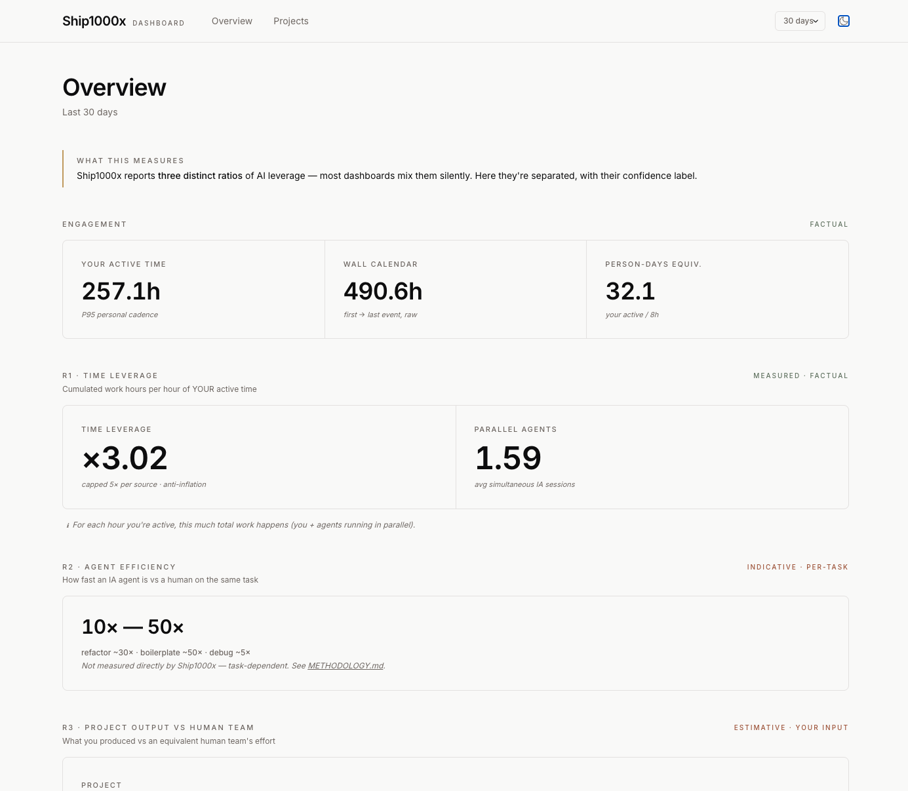
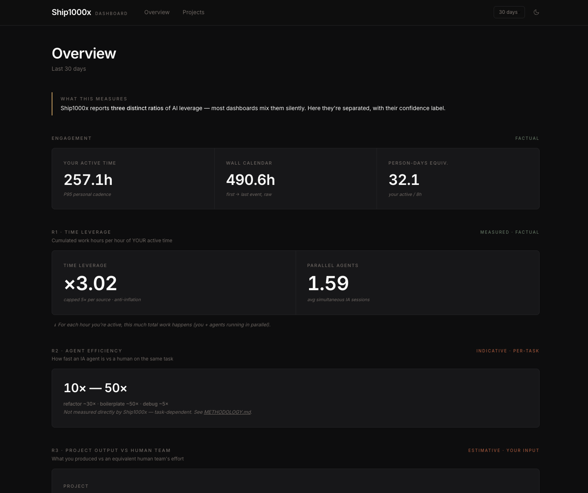
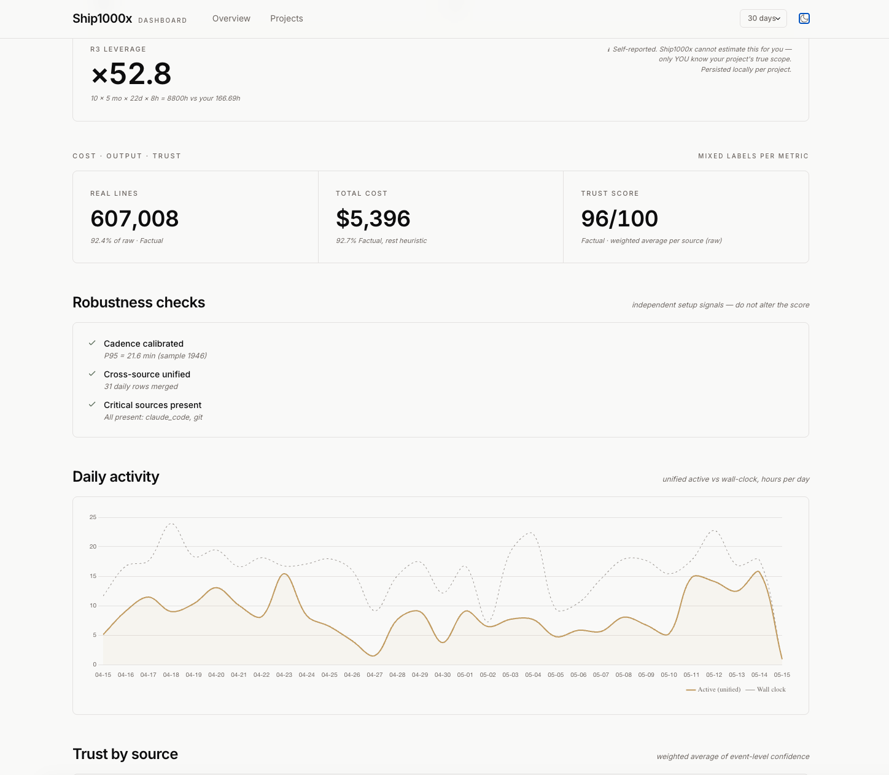

# Ship1000x

> Track what you actually ship with AI.

Local-first tracker for AI-assisted development. Measures **focus time**,
**code produced** (real vs generated), and **LLM cost** across Claude Code,
Codex, Cursor, git, and shell activity — all from your own machine, no SaaS.

[](https://github.com/Mr1000xGrowth/ship1000x/actions/workflows/test.yml)
[](LICENSE)
[](https://www.python.org/downloads/)
[]()


## Why

Hours in front of your IDE are not hours coding. AI-assisted development mixes
thinking, prompting, waiting, reviewing, and typing in ways that make naive
"screen time" metrics useless. Ship1000x gives you honest numbers :

- **Focus time** : weighted activity intervals (not wall clock), so a 2-minute
  bathroom break doesn't inflate your session.
- **Output classified** : lines committed split into `real` / `seed` /
  `vendored` / `generated` — no more boasting about the `package-lock.json`
  diff.
- **LLM cost** : token-based estimates from rollouts (Anthropic + OpenAI
  pricing baked in), not flat-rate fiction.
- **Multi-machine** : one user, several Macs, deduped commits, attributed by
  first-machine-to-see heuristic.
- **Privacy by default** : all data lives in `~/.config/ship1000x/`. No
  telemetry. Optional opt-in push to your own S3 bucket (AWS/B2/R2/Garage).

## Install

```bash
pip install ship1000x       # once published to PyPI
ship1000x init              # 5-question setup wizard
ship1000x ingest            # first scan of your AI tool logs
ship1000x today             # see today's activity
```

In beta (`v0.5.0`), install from source :

```bash
git clone https://github.com/Mr1000xGrowth/ship1000x.git
cd ship1000x
pip install -e .
ship1000x init
```

## What it collects

| Source | Where | What |
|---|---|---|
| Claude Code | `~/.claude/projects/*/history.jsonl` | Sessions, tokens, cache hits, tool calls |
| Codex CLI | `~/.codex/sessions/**/rollout-*.jsonl` | Sessions, token usage, model used |
| Codex Desktop | `~/.codex/state_5.sqlite` logs | Sessions, turns, tool calls |
| Codex macOS app | `~/Library/Logs/com.openai.codex/` | Turn starts, approvals |
| Cursor | Workspace + global SQLite | Chat turns, edits |
| Cline | `~/.claude_cline/chats/*.jsonl` | Chat turns |
| git | `git log` across all repos under `$HOME` | Commits, lines added/deleted, classified |
| shell | zsh history (opt-in, requires `EXTENDED_HISTORY`) | Git-intent commands |
| Mac system | `pmset` / `log show` (opt-in) | Screen wake/sleep, unlock |
| Web exports | Drop ZIPs from ChatGPT/Claude web exports | Conversations (aggregated) |

All collectors are **read-only**. Nothing is ever modified, deleted, or
transmitted from your machine without explicit opt-in.

## Quick start in 30 seconds

```bash
ship1000x init                     # interactive setup, then auto-runs ingest + highlights
```

That's it. After the wizard you immediately see your **Highlights** showcase :

```
🚀 Highlights — derniers 30 jours
  Effet de levier IA           x3.0        [Defensible, capped]
  Sessions IA en parallèle     1.6         (moyenne)
  Équivalent jours-homme       32 jours    (en 30 jours cal.)
  Production réelle            607 008     lignes vrai code (92%) [Factual]
  Coût agentique               $5 396      [93% Factual, rest heuristic]
  Trust Score                  96/100      base (Factual). +8 bonuses → 100/100
```

Want a visual dashboard ? One command :

```bash
ship1000x dashboard                # opens http://localhost:10000 in your browser
```

Premium neutral design (Inter typography, ambre accent), localhost-only
(refuses external connections), no auth needed (your machine, your data).
Pages : Overview (6 metric cards + trend chart + Trust Score breakdown by
source) + Projects (sortable matrix project × tool × cost). Window selector
7 / 14 / 30 / 60 / 90 / 180 / 365 days. Dark mode auto.

## What's new in v0.5.0 (May 2026)

- **3-ratios overview redesign** — the dashboard now reports R1 (Time leverage,
  Factual), R2 (Agent efficiency, Indicative), and R3 (Project output vs human
  team, Estimative · your input) as separate sections with explicit confidence
  labels. No more conflating "AI Leverage ×N" without saying which ratio.
- **R3 interactive widget** — pick a project, enter equivalent team size +
  months → leverage computed and persisted per-project in localStorage.
  Honest disclaimer: only YOU know your project's true scope.
- **Trust Score honesty fix** — score is now the raw weighted-average of
  per-source confidence (no more silent capping of `base + bonuses → 100`).
  Ex-bonuses become independent **robustness checks** (cadence, unified,
  critical sources) reported alongside, never inside, the score.

## What's new in V1 (v0.2.0 → v0.4.0)

- **`ship1000x highlights`** — the showcase view. Audit-ready WOW numbers
  with explicit confidence labels per metric (Factual / Defensible /
  Indicative / Heuristic).
- **`ship1000x calibrate`** — computes your personal P95 cadence
  threshold from your actual rhythm (no arbitrary 5-min hardcode).
- **`ship1000x today --compare-modes`** — see 5 active-time modes side
  by side : strict (5 min) / auto P95 / loose (15 min) / agent IA estimated
  / wall-clock. Arithmetic verification visible.
- **`ship1000x summary`** — cross-tab matrix : per-project breakdown by
  tool (Claude Code, Codex, Cursor, …) + dominant tool + cost. Filter by
  `--client <name>` if you tag projects.yaml with `client:`.
- **Trust Score** — every metric carries its confidence level. Per-source
  scoring (high=100, medium=70, low=40) + global composite with bonuses
  (cadence calibrated, daily_unified populated) and penalties (critical
  source missing).
- **Cross-source unified active time** — fixes the multi-agent overcount
  bug (×2.85 measured on real DB). New `daily_unified` table merges
  human events from all sources before aggregating.
- **Aliases** — merge multiple project_ids into one canonical project
  (e.g. local folder name "myapp" + git remote "github.com/org/myapp" =
  one project) via `projects.yaml > aliases:`.

## All commands

```bash
ship1000x init                     # interactive setup (auto-runs ingest + highlights at the end)
ship1000x dashboard                # 🌐 local web dashboard at localhost:10000
ship1000x highlights               # 🚀 the showcase — start here
ship1000x pulse                    # one-line daily check (the morning ritual)
ship1000x calibrate                # personal P95 cadence threshold
ship1000x today                    # today by project
ship1000x today --compare-modes    # 5 active-time modes side-by-side
ship1000x summary --since 30d      # matrix per-project × tool
ship1000x summary --client X       # filter by client tag
ship1000x week                     # last 7 days by project
ship1000x project my-app --since 30d  # drill-down on one project
ship1000x insights                 # full report (ratios + multipliers + signals + Trust Score)
ship1000x multiplier               # output factor vs senior-mid baseline
ship1000x profile                  # heatmap, sessions, habits
ship1000x signals                  # alerts: burnout, project drift, cost spikes
ship1000x compare proj-a proj-b    # side-by-side 2 projects
ship1000x export --output rep.md   # generate full Markdown report
ship1000x ingest                   # manual data collection (the cron does it nightly)
ship1000x status                   # DB state + last ingestion
ship1000x doctor                   # diagnostic + fix common issues
ship1000x delete --confirm         # wipe all local data
```

Run `ship1000x --help` for the full list (40+ commands including
`rollup`, `push`, `daily`, `audit`, `reclassify`, `discover`, `health`,
`install-scheduler`).

## Screenshots

### `ship1000x highlights` — the showcase

```
╭───────────────────── 🚀 Highlights — derniers 30 jours ──────────────────────╮
│                                                                              │
│   Effet de levier IA           x3.0        [Defensible, capped]              │
│   Sessions IA en parallèle     1.6         (moyenne, instances simultanées)  │
│   Équivalent jours-homme       32 jours    (en 30 jours cal.)                │
│                                                                              │
│   Production réelle            607 008   lignes vrai code (92%) [Factual]    │
│   Coût agentique               $5 396      [93% Factual, rest heuristic]     │
│   Cost / ligne nette           $0.0082   ultra-efficient                     │
│                                                                              │
│   Trust Score                  96/100     Factual · weighted avg per source  │
│   Sources captées              7          Factual + Defensible               │
│                                                                              │
│   Robustness checks                                                          │
│     ✓ Cadence calibrated  P95 = 21.6 min (sample 1946)                       │
│     ✓ Cross-source unified  31 daily rows merged                             │
│     ✓ Critical sources present  All present: claude_code, git                │
│                                                                              │
│   → Avec 1h de ton temps, tu génères ~3.0h d'exécution agentique             │
│     et 2361 lignes de vrai code défendable.                                  │
│                                                                              │
│   Calculé avec cap_time = 21.6 min (P95 personnel)                           │
│   Wall_brut capped at 5x duration_sec per source (anti-inflation)            │
╰──────────────────────────────────────────────────────────────────────────────╯
```

### `ship1000x today --compare-modes` — 5 active-time modes side by side

```
Modes compares — 2026-05-15
(21 events humains, 2 source(s) distincte(s), machine=your-mac.local)

┏━━━━━━━━━━━━━━━━━━━━━━━┳━━━━━━━━━━━┳━━━━━━━┳━━━━━━━━━━━━━━━━━━━━━━━━━━┓
┃ Mode                  ┃ Threshold ┃ Duree ┃ Note                     ┃
┡━━━━━━━━━━━━━━━━━━━━━━━╇━━━━━━━━━━━╇━━━━━━━╇━━━━━━━━━━━━━━━━━━━━━━━━━━┩
│ ACTIF HUMAIN          │           │       │                          │
│   strict (5min)       │   5.0 min │   35m │ conservateur, hardcode   │
│   auto P95            │  21.6 min │   54m │ applique                 │
│   loose (15min)       │  15.0 min │   54m │ genereux                 │
├───────────────────────┼───────────┼───────┼──────────────────────────┤
│ AGENT IA (estime)     │           │       │                          │
│   travail autonome IA │         — │    0m │ wall - actif humain auto │
├───────────────────────┼───────────┼───────┼──────────────────────────┤
│ TOTAL                 │           │       │                          │
│   wall-clock          │         — │   54m │ premier → dernier event  │
└───────────────────────┴───────────┴───────┴──────────────────────────┘
Verification : actif humain auto + agent IA = wall-clock ✓
```

### `ship1000x calibrate` — your personal P95 cadence

```
                Profil cadence — maintainer@example.com
┏━━━━━━━━━━━━━━━┳━━━━━━━━━━━━━━━━━━━━━┳━━━━━━━━━━━━━━━━━━━━━━━━━━━━━━━━━━━━━━┓
┃ Percentile    ┃              Valeur ┃ Interpretation                       ┃
┡━━━━━━━━━━━━━━━╇━━━━━━━━━━━━━━━━━━━━━╇━━━━━━━━━━━━━━━━━━━━━━━━━━━━━━━━━━━━━━┩
│ P50 (mediane) │   162 sec (2.7 min) │ moitie de tes intervalles font <= ca │
│ P75           │   385 sec (6.4 min) │ 75% des intervalles                  │
│ P90           │  789 sec (13.2 min) │ 90% des intervalles                  │
│ P95           │ 1299 sec (21.6 min) │ threshold AUTO applique              │
│ P99           │ 5509 sec (91.8 min) │ vraies pauses au-dela                │
└───────────────┴─────────────────────┴──────────────────────────────────────┘
Sample size : 1946 intervalles sur 14 jours
Profil : sessions tres etalees (pauses cafe naturelles incluses)
```

### `ship1000x pulse` — the morning ritual (one-line check)

```
🚀 15:21 · 1.0h active · $77 · 6 commits · 2 sources active ↘ -89% vs 7d avg
```

### Web dashboard (`ship1000x dashboard`)

Premium neutral design (Inter + ambre accent), localhost-only, dark mode auto.
Overview restructured around the **3 distinct ratios** of AI leverage —
each labelled (Factual / Indicative / Estimative). Window selector
7 / 14 / 30 / 60 / 90 / 180 / 365 days.

| Light mode | Dark mode |
|---|---|
|  |  |

**R3 interactive widget** — pick a project, enter equivalent team size +
months → leverage computed (here ×52.8: 10 people × 5 months vs 166h on
`vantacrew-console`). Estimates persist per-project in localStorage.



## Privacy & consent

The first thing `ship1000x init` does is show a consent block :

```
Ce tracker collecte UNIQUEMENT des metriques quantitatives (timestamps,
durees, compteurs). AUCUN contenu (prompts, fichiers, diffs) ne quitte
votre machine.

Si tu actives le partage cloud, SEULS les daily_rollup agreges
(date, projet, duree, nb events) sont pushes vers le bucket S3 que tu
auras configure. Le contenu brut reste 100% local.
```

Three levels per-project :

- `disabled` : project not scanned at all
- `private` : scanned locally, never pushed anywhere (default)
- `aggregated` : daily rollups (date, project, duration, event count) may
  be pushed to your own S3 bucket if `share_cloud: true`

`ship1000x init` walks you through the share level for each detected
project. Run `ship1000x projects --select` any time to reconfigure (useful
after onboarding a new client repo or moving a side project off your work
machine). `ship1000x privacy` shows the current state read-only, and
`ship1000x daily` warns you when new projects appear in the DB without an
explicit entry in your `share` map.

## Optional : push to your own S3 bucket

If you want to visualize your data in a tool other than the CLI (a home-built
dashboard, a BI tool, another script), enable cloud push :

```yaml
# config/privacy.yaml
cloud:
  provider: s3
  bucket: my-tracker-data
  endpoint: "https://s3.us-west-004.backblazeb2.com"  # or AWS/R2/Garage/...
  push_enabled: true

consent:
  share_cloud: true
```

Then run `ship1000x push`. Credentials via env (`AWS_ACCESS_KEY_ID` +
`AWS_SECRET_ACCESS_KEY`) or `~/.aws/credentials`. Use `ship1000x doctor --fix`
to interactively set them up.

Compatible with : **AWS S3**, **Backblaze B2**, **Cloudflare R2**,
**[Garage](https://garagehq.deuxfleurs.fr/) self-hosted**, **MinIO**.

## Requirements

- macOS or Linux (Windows untested)
- Python 3.10+
- Any of the AI tools you want to track actually installed and used

## Development

```bash
git clone https://github.com/Mr1000xGrowth/ship1000x.git
cd ship1000x
pip install -e ".[dev]"
pytest tests/              # 48 tests
ruff check .
```

## Roadmap

**v0.1.0** — initial alpha (April 2026)
- [x] 11 collectors (Claude Code, Codex ×3, Cursor, Cline, git, shell, macOS)
- [x] Multi-machine dedup by commit hash + machine_id
- [x] Line classification (real / seed / vendored / generated)
- [x] Token-based LLM cost (Anthropic + OpenAI)
- [x] S3 push opt-in
- [x] 40+ CLI commands + Markdown export

**v0.2.0 → v0.4.0** — current beta (V1 hardening + dashboard)
- [x] Per-project consent wizard (`init` + `projects --select`)
- [x] Unclassified-projects warning at `daily`
- [x] Claude Code SSE chunks dedup by message.id (fixes ×2.49 overcount)
- [x] Cache tokens captured (`cache_read_input_tokens` + `cache_creation_input_tokens`)
- [x] Cross-source unified active time (`daily_unified` table, fixes ×2.85 multi-agent overcount)
- [x] Personal P95 cadence threshold (adaptive per user)
- [x] Trust Score per source + global composite (the differentiator)
- [x] `highlights` showcase command + first-launch UX (`init` chains to highlights)
- [x] `summary` cross-tab matrix (project × tool, --client filter)
- [x] `today --compare-modes` (5 modes side by side)
- [x] Privacy hardening : filter bypass fix, 46 keys whitelist, recursive path anonymization, central guardrail
- [x] Conservative `share_config` for cloud push (PII hashed, financials stripped by default)
- [x] Productivity ratios based on `lines_real_added` (V2 breakdown defensible)
- [x] 6 new public English docs (COVERAGE / METHODOLOGY / PRIVACY / TRUST_SCORE / COLLECTORS / QUICKSTART)
- [x] Aliases support in `projects.yaml` (merge logically-same projects)
- [x] CI green on Python 3.10/3.11/3.12 (ubuntu + macos)

**v0.5.0** — Trust Score honesty + 3-ratios overview (May 2026)
- [x] Trust Score = raw weighted-average per source (no more `base + bonuses → 100` cap)
- [x] Robustness checks reported separately from the score (cadence, unified, critical sources)
- [x] Web dashboard overview restructured around R1 / R2 / R3 with explicit confidence labels
- [x] R3 interactive widget (project selector + people/months → leverage, persisted per-project)
- [x] CHANGELOG documents the rationale (the `96 + 8 = 100` incident)

**v0.6.0** (next)
- [ ] PyPI release (`pip install ship1000x`)
- [ ] `ship1000x explain <metric>` for inline transparency
- [ ] `ship1000x reconcile` integrated (Anthropic Admin API cross-check)
- [ ] PDF export (audit-ready format)
- [ ] Continue.dev, Aider, Antigravity collectors (community welcome — see [CONTRIBUTING.md](CONTRIBUTING.md))

**v1.0.0** (when stable API)
- [ ] Plugin system for community-contributed collectors
- [ ] Packaging as standalone macOS app
- [ ] Linux distro packages (deb/rpm)
- [ ] GitHub API enrichment (CI status, PR reviews)
- [ ] Better Codex coverage via mac_system focus apps cross-reference

## License

[MIT](LICENSE) — do whatever you want, no warranty.

## Credits

Built by [Mr1000xGrowth](https://github.com/Mr1000xGrowth).
Developed with heavy use of Claude Code and Codex — and yes, those sessions
are tracked by Ship1000x itself.
